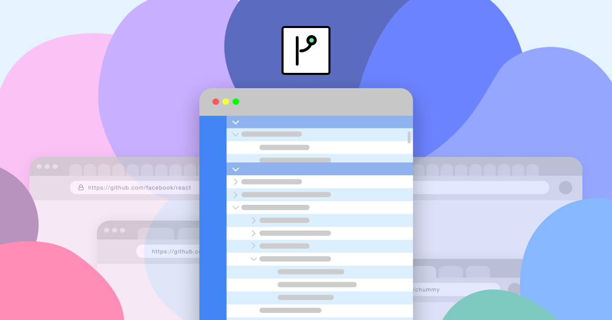

# [Chummy](https://www.chummy.atomiccode.io) - Use Github with 🔋's included

  
  
  
  
  
  

---

---

Visit [chummy.atomiccode.io](https://www.chummy.atomiccode.io) for more information!

Chummy is a browser extension that helps you stay focused on what matters to you, whether that’s developing, contributing, browsing, or stargazing a bunch of random repositories. You'll feel right at home with its IDE-like design and easy-to-use interface.

Get started with Chummy for free in just one click!
